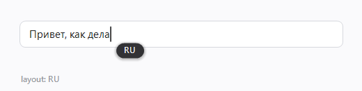
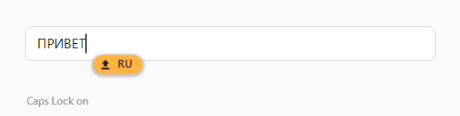

# Caret Language Indicator

[English](README.md) · **Русский**

Небольшая плашка, которая показывает текущую раскладку клавиатуры и состояние
Caps Lock прямо у текстового курсора — так же, как macOS показывает источник
ввода.





*Иллюстрации отрисованы скриптом [`docs/make-illustration.ps1`](docs/make-illustration.ps1),
а не сняты с чьего-то рабочего стола — формы и цвета те же, что рисует сама
утилита.*

В Windows такого индикатора нет. В PowerToys его тоже нет: запросы на эту
функцию до сих пор открыты. Языковая панель живёт в трее, далеко от того места,
где вы печатаете, поэтому неверную раскладку замечаешь уже после строки
абракадабры.

## Зачем ещё одна

Существующие индикаторы раскладки ищут курсор через классический Win32 API,
`GetGUIThreadInfo`. Это работает в Блокноте, Office и нативных элементах — и
не возвращает ничего в приложениях на Chromium и Electron, которые рисуют
курсор сами. Chrome, VS Code, Telegram, Discord, Slack: ровно там, где сегодня
и происходит большая часть набора.

Эта утилита в таком случае обращается к UI Automation и берёт позицию курсора
из `TextPattern.GetSelection().GetBoundingRectangles()` — Chromium его честно
отдаёт. Три уровня, по убыванию точности:

1. `GetGUIThreadInfo` — настоящая каретка Win32.
2. Прямоугольник выделения `TextPattern` — Chromium, Electron, UWP.
3. Габариты сфокусированного текстового элемента — всё остальное; тогда плашка
   встаёт рядом с полем, а не у курсора.

## Установка

Скачайте `CaretLangIndicator.exe` из
[последнего релиза](../../releases/latest) и запустите двойным щелчком. Это вся
процедура — один файл, без скриптов и установочных пакетов.

Программа спросит, устанавливать ли её. Ответите «да» — скопирует себя в
`%LOCALAPPDATA%\CaretLangIndicator` и дальше будет запускаться вместе с
Windows. Ответите «нет» — просто поработает оттуда, где лежит, ничего не меняя.

Права администратора не нужны, службы не создаются, за пределы вашего профиля
ничего не пишется.

```powershell
CaretLangIndicator.exe -Install -OnlyWhenCaps   # тихая установка с параметрами
CaretLangIndicator.exe -Uninstall               # удалить
CaretLangIndicator.exe -NoPrompt                # разовый запуск без вопросов
```

Параметры, переданные вместе с `-Install`, сохраняются в ярлыке автозагрузки и
переживают перезагрузку.

Файл не подписан, поэтому при первом запуске SmartScreen предупредит —
«Подробнее», затем «Выполнить в любом случае». Либо соберите сами, это одна
команда.

## Параметры

| Ключ | Значения | По умолчанию | Что делает |
|---|---|---|---|
| `-Anchor` | `Caret` `Field` `Corner` | `Caret` | к чему привязана плашка |
| `-VAlign` | `Below` `Center` | `Below` | под кареткой или вровень со строкой |
| `-Side` | `Left` `Right` | `Left` | с какой стороны поля, если привязка к полю |
| `-OffsetX` | пиксели | `8` | отступ от каретки |
| `-OffsetY` | пиксели | `2` | сдвиг по вертикали |
| `-FieldGap` | пиксели | `12` | отступ от края поля |
| `-OnlyWhenCaps` | — | выкл | показывать только при включённом Caps Lock |
| `-Glass` | — | выкл | акрил Windows 11 вместо плотной тёмной плашки |
| `-Interval` | мс | `120` | период опроса |

`-Anchor Corner` ставит плашку в фиксированный угол экрана, где она не
перекрывает ничего. `-OnlyWhenCaps` даёт маковскую схему: раскладка живёт в
меню-баре, а плашка появляется только ради Caps Lock.

## Сборка

Ставить ничего не нужно — компилятор C# уже есть в Windows:

```powershell
.\build.ps1
```

Скрипт компилирует `src/Indicator.cs` через `csc.exe` из
`C:\Windows\Microsoft.NET\Framework64\v4.0.30319` и выдаёт exe на 17 КБ.
В работе — около 80 МБ памяти и заметно меньше 1% одного ядра в простое.

## Версия на PowerShell

`caret-lang-indicator.ps1` — то же самое скриптом. Медленнее и тяжелее (около
165 МБ и ощутимо больше нагрузки на процессор), зато у него есть два ключа,
полезных когда в каком-то приложении плашка встаёт не туда:

```powershell
.\caret-lang-indicator.ps1 -Diagnose          # 10 секунд печатает, что видит
.\caret-lang-indicator.ps1 -Log detect.log    # пишет лог, пока вы работаете
```

В логе видно, какой из трёх уровней сработал (`caret`, `textpattern`, `field`)
и в каком приложении.

## Известные ограничения

- Некоторые приложения не отдают ни каретки, ни вменяемого сфокусированного
  элемента. Там плашка откатывается на прямоугольник поля, а если нет и его —
  не показывается вовсе; помогут `-Fallback Mouse` или `-Anchor Corner`.
- Если у приложения вплотную к полю стоят кнопки (Telegram), плашка окажется
  рядом с ними. Положения у поля, безопасного во всех приложениях, не
  существует — на этот случай есть `-Anchor Corner`.
- Координаты берутся в физических пикселях, поэтому на нескольких мониторах с
  разным масштабированием возможны смещения.

## Лицензия

MIT.
